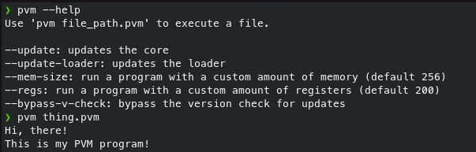

# PVM

PVM is a Turing-complete esoteric interpreted programming language similar to Assembly implemented in Python. It's a hobby project in active development.
<br>
Below is an example of PVM's usage.



---

## How to install

### Arch Linux or Arch-Based Linux Distributions
You can simply use an AUR helper to install pvm-git with commands like `yay -S pvm-git` or `paru -S pvm-git`.

### Other Linux distributions or MacOS
Download [The general Unix installer](/installers/general-unix-installer.py), use `chmod +x /PATH/TO/INSTALLER.py` and run it as sudo. The reason for the root privileges are because the installer adds a file to `/usr/local/bin/pvm`.

### Windows
Download [The Windows Installer](/installers/windows-installer.py), make sure you have Python 3.x installed and in your PATH, and run it through the command line using `python /PATH/TO/INSTALLER.py`. WARNING: THE WINDOWS VERSION HASN'T BEEN TESTED. PLEASE REPORT ANY BUGS FROM THE ISSUES PAGE ON THE PVM PAGE.

---

## Features

### Turing Complete
Yes, you can literally make anything in this language with enough time and dedication.

### Easy To Understand
I explicitly designed the syntax to be understandable.

### Great Way To Be Creative
You know what they say, limitations make creativity. While this language is Turing-complete, it doesn't have that many built-in features, which leads users to reinvent the function they would've otherwise taken for granted.

---

## Usage

PVM is an extremely easy language to learn. While I don't recommend it to get into programming, it can be good for grasping low-level concepts without handling hard-looking code.

### Basic Concepts

PVM has registers instead of variables for storing data at runtime, and a global storage file with a maximum space of 1 GB. By default, there are 200 registers, going from `REG1` to `REG200`. All of these registers start out at the integer 0 (zero).
<br>
There's also limited amount of memory to store instructions in. This defaults to 256, meaning a program normally can't have more than 256 lines of code, which does not include comments and empty lines. You can change this by adding the "--mem-size" optional argument when running the PVM loader and adding a number after it.

### Commands

- Comments: You can add comments to your code with the `;` character. Comments are ignored by the interpreter and are usually used to explain what a block of code does or disable a single line of code for testing.
- LOAD [REGISTER NAME] [VALUE]: Loads a value to a register, the value can be a string, an integer or a decimal. You cannot put a comment on the same line of a LOAD command if the value is a string.
- OUT [REGISTER NAME]: Outputs the value stored in a register. Cannot output literals.
- IN [REGISTER NAME] [QUESTION (optional, add `""` for nothing)]: Asks the user for blocking input, and stores the answer in a register.
- CLR [REGISTER NAME]: Resets the value of a register to 0, basically a shorter way of doing `LOAD [REGISTER] 0`.
- SWP [REGISTER 1] [REGISTER 2]: Swaps the values of two registers.
- SUM [NUMBER 1] [NUMBER 2] [REGISTER]: Adds the values of [NUMBER 1] and [NUMBER 2] and stores the result in [REGISTER].
- SUB [REGISTER 1] [REGISTER 2] [REGISTER]: Subtracts the values of [NUMBER 1] and [NUMBER 2] and stores the result in [REGISTER].
- DIV [REGISTER 1] [REGISTER 2] [REGISTER]: Divides the values of [NUMBER 1] and [NUMBER 2] and stores the result in [REGISTER].
- MULT [REGISTER 1] [REGISTER 2] [REGISTER]: Multiplies the values of [NUMBER 1] and [NUMBER 2] and stores the result in [REGISTER].
- TM [REGISTER NAME]: Stores the current time passed since the Unix Epoch in a register. Good for cooldown mechanisms!
- LOOP [N]: Begins a loop that runs N times. The end of the looped section must end with ENDL.
- $[FUNCTION NAME]: Begins the declaration of a function. The end of the function body must end with ENDF.
- CALL [FUNCTION NAME]: Runs a function.
- INC [REGISTER NAME]: Increments the integer stored in a register by 1.
- DEC [REGISTER NAME]: Decrements the integer stored in a register by 1.
- TOINT [REGISTER NAME]: Attempts to turn the value in a register to an integer.
- TOSTR [REGISTER NAME]: Attempts to turn the value in a register to a string.
- TOFLOAT [REGISTER NAME]: Attempts to turn the value in a register to a float.
- REGDUMP: Dumps the values of all registers for debugging.
- CUT [REGISTER NAME] [STARTING INDEX] [ENDING INDEX]: Cuts the string value in a register with desired indexes.
- IF [CONDITION]: Checks if the condition provided is true, and executes a block of code if it is. Block must end with ENDIF. ELSE is supported but must come before ENDIF. ELSEIF is not supported at the moment. Operators allowed are:
    - == OPERATOR: Checks if the two registers are equal.
    - != OPERATOR: Checks if the two registers are not equal.
    - < OPERATOR: Checks if the value of register 1 is less than register 2.
    - \> OPERATOR: Checks if the value of register 1 is more than register 2.
    - \>= OPERATOR: Checks if the value of register 1 is more than or equal to register 2.
    - <= OPERATOR: Checks if the value of register 1 is less than or equal to register 2.
    - STARTWITH OPERATOR: Checks if the value of register 1 starts with register 2.
    - ENDWITH OPERATOR: Checks if the value of register 1 ends with register 2.
- GRA [WIDTH] [HEIGHT]: Opens a graphical window with the desired width and height. The window will close in case of the program ending, usually accompanied by a game loop.
- GRATITLE [TITLE]: Changes the title of the graphical window that's open.
- FILLGRA [COLOR]: Fills the graphical window with a color. The available colors are:
    - RED
    - BLUE
    - GREEN
    - CYAN
    - YELLOW
    - BLACK
    - WHITE
    - MAGENTA
    - BROWN
    - GRAY
    - DARK_GRAY
- PIX [COLOR] [TOP] [LEFT]: Makes a pixel with the desired color and coordinates.
- CIRC [X] [Y] [RADIUS] [COLOR]: Makes a circle at the desired coordinates with the desired radius and color.
- RECT [TOP] [LEFT] [WIDTH] [HEIGHT] [COLOR]: Makes a rectangle at the desired coordinates with the desired size and color.
- DELAY [SECONDS]: Pauses the program for a certain amount of time, supports decimals.
- LOADSOUND [PATH] [NAME]: Loads a sound from a path to memory with the desired name. MUST HAVE A GRAPHICAL WINDOW OPEN.
- PLAYSOUND [NAME] [LOOPED?]: Plays a loaded sound and loops it forever if the second argument is TRUE. There MUST be a second argument, even if looping isn't intended, then it must be FALSE. MUST HAVE A GRAPHICAL WINDOW OPEN.
- STOPSOUND [NAME]: Stops a playing sound. MUST HAVE A GRAPHICAL WINDOW OPEN.
- REMSOUND [NAME]: Removes a sound from memory. MUST HAVE A GRAPHICAL WINDOW OPEN.
- LSSOUND: Lists all loaded sounds. MUST HAVE A GRAPHICAL WINDOW OPEN.
- MEMID [ID]: Sets an ID for saving data.
- ADDMEM [KEY] [VALUE]: Adds a piece of memory to the memory ID with a key and value to persistent storage, and overwrites it if it exists.
- DELMEM [KEY]: Deletes a key from memory at the memory ID.
- GETMEM [REGISTER] [KEY]: Retrieves a key's value from the memory ID and saves it to the desired register.
- DELSAVE: Deletes the entirety of the saved keys at the memory ID.
- MOV [REGISTER 1] [REGISTER 2]: Moves the value at register 2 to register 1, register 2 will remain unchanged.
- RANDI [REGISTER] [MIN] [MAX]: Sets the value of a register to a random integer between MIN and MAX.
- HLT: Terminates the program. Any graphical windows will be destroyed. Registers will be reset but anything saved to storage via the MEM commands will stay.
- BINDKEY [FUNCTION NAME] [KEY]: Binds a key press to a function. MUST HAVE A GRAPHICAL WINDOW OPEN.
- BINDKEYREL [FUNCTION NAME] [KEY]: Binds a key release to a function. MUST HAVE A GRAPHICAL WINDOW OPEN.
- BINDCLICK [TOP] [LEFT] [WIDTH] [HEIGHT] [FUNCTION NAME]: Binds a function to a click in a specific region.
- CLOCK [FPS]: Calculates the delta for a static FPS and delays execution for that amount of time.
- CFONT [SIZE] [ITALIC] [CACHE NAME]: Caches a font object with the provided size and italic if TRUE. CACHE NAME is only the name that the font is cached for, not a font name. MUST HAVE A GRAPHICAL WINDOW OPEN.
- DFONT [CACHE NAME] [TOP] [LEFT] [COLOR] [TEXT]: Draws a cached font with the coordinates, color and text provided. Text must be in double quotes. MUST HAVE A GRAPHICAL WINDOW OPEN.
- GETMX [REGISTER]: Gets the X coordinate of the mouse and saves it to a register. MUST HAVE A GRAPHICAL WINDOW OPEN.
- GETMY [REGISTER]: Gets the Y coordinate of the mouse and saves it to a register. MUST HAVE A GRAPHICAL WINDOW OPEN.
- RET: Returns early from a function call. Can ONLY be used in a function.
- LOADSPRITE [PATH] [NAME]: Loads a sprite into memory. Path can be relative or absolute.
- DSPRITE [NAME] [TOP] [LEFT]: Draws a sprite at the given coordinates. MUST HAVE A GRAPHICAL WINDOW OPEN.
- POSTWEB [SITE URL] [DATA IN KEY=VALUE FORMAT, CAN BE AS LONG AS YOU WANT]: Sends a POST request to the website specified with the given data parsed into JSON.
- READSITE [SITE URL] [REGISTER]: Reads data from a website and saves the UTF-8 decoded result into a register.

### Example Snippet

Here's a small snippet of a "Hello, world!" program in PVM.

```
LOAD REG1 "Hello, world!"
OUT REG1
HLT
```